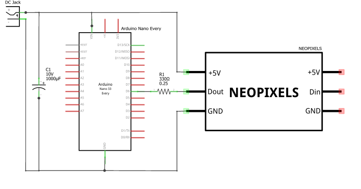

# hpdisplay
A real life hitpoints display (health bar) for Old School RuneScape.

# Overview
This plugin allows you to make a real life LED health bar using an Arduino, LED strip and a few other electronic components. 

# Video Tutorial
"VIDEO COMING SOON. LINK WILL BE PLACED HERE."

# Parts List
In order to build your hitpoints display you will need the following components:

Parts:

- Arduino Nano Every 
- PCB (I used 4cm x 6cm) 
- 2.1mm DC Jack PCB Mount 
- 1000µF 10V Capacitor 
- Adafruit Mini Skinny NeoPixel Digital RGB LED Strip - 144 LED/m - 1m BLACK - Product ID: 2970 
- Male & Female 2.54mm Header Pins 
- 300 to 500 Ohm Resistor 
- Micro USB Cable 
- 5V 2A Power Supply 
- 24AWG Silicone Wire  
- Heat Shrink 
- Breadboard & Jumper Wires (optional) 

Tools: 

- Soldering Iron  
- Wire cutters 
- Scissors 

# Step 1 - Build the Circuit: 

Start by removing the weatherproof casing from the NeoPixel LED strip. After that, cut the strip down from 144 LEDs to 99 LEDs (This allows a single LED to represent a single HP if you have a hitpoints level of 99). 

Build the breadboard circuit or solder the components to the PCB as shown in the pictures below (watching the video is helpful for this step). I recommend building the circuit on a breadboard to ensure that it is functioning properly before soldering the components to your PCB. 

# Step 2 - Install the hpdisplay plugin: 

Install the hpdsiplay plugin through the RuneLite Plugin Hub. 

# Step 3 - Download the Arduino IDE: 

Go to https://www.arduino.cc/en/software and download the correct Arduino IDE for your operating system.  

Once downloaded, install the package by opening it and following any prompts. 

On the IDE’s menu go to Sketch>Include Library>Manage Libraries. 

In the Library Manager window, type FastLED in the search box. 

When FastLED appears, click on Install. 

# Step 4 - Program the Arduino 

Connect the Arduino to your PC with the micro USB cable. 

In the Arduino IDE, go to Tools>Board and select "Arduino Nano Every". 

In the Arduino IDE, go to Tools>Port and select the port which your Arduino is connected through. 

For the arduino sketch, go to [arduino_sketches](https://github.com/austinwblake/hpdisplay/tree/master/arduino_sketches)

I have created two versions: 

"hpdisplay_original.ino" turns off LEDs as you lose HP and fades from green to yellow to red. 

"hpdisplay_osrs.ino" mimics the green and red OSRS health bar. 

Copy and paste the Arduino sketch into the Arduino IDE. 

Save the sketch to your PC. 

Upload the sketch to the Arduino by clicking on the right-pointing arrow on the IDE’s window. 

# Step 5 - Using the Health Bar 

Connect the 5V 2A power supply to the DC jack. 

Connect the Arduino to your PC with the micro USB cable. 

Login to RuneLite and open the configuration window. 

In the configuration window go to HP Display>Edit plugin configuration. 

Under "Serial Port", type in the serial port which your arduino is connected through (you can check this in the arduino IDE). The arduino will automatically connect and you will get the following message in the chat: "Connected to Arduino through Serial Port: ". 

If you entered the incorrect serial port you will get the following message in the chat: "Unable to Connect to Arduino through Serial Port: ". 

As soon as your HP updates (you either lose or gain HP) the LEDs will illuminate and the display will be functional.   

RuneLite will save the serial port which you have entered and the arduino will automatically connect after logging in (assuming the arduino is connected through the same serial port). 

Before logging out, check the "Disconnect" box to turn off the LEDs. If you do not do this before logging out the LEDs will stay illuminated. 

In this case you can turn them off by unplugging the Micro USB followed by the 5V 2A power supply or by unplugging the LED header and plugging it back in. 

## WARNING 

Make sure that you have BOTH the power supply and USB cable connected when using the health bar. Do not power the LEDs using only the USB port. This could damage your USB port or your arduino. 

# Step 6 - Mounting the LEDs: 

I will leave it up to you to get creative and display your LED strip and circuit board however you prefer! I mounted my LED strip to my monitor and fastened the circuit board to the back as shown in the picture below. You could even fasten it to a monitor stand, mount it on the wall or even 3D print a mount for it. I would love to see what people come up with! 

## Brightness Control: 

You can control the brightness of the health bar in the arduino sketch under "void setup ()". 

FastLED.setBrightness(5); 

This can be any value between 0-255. I personally would not go any higher than 20 as anything above 20 is too bright. 
